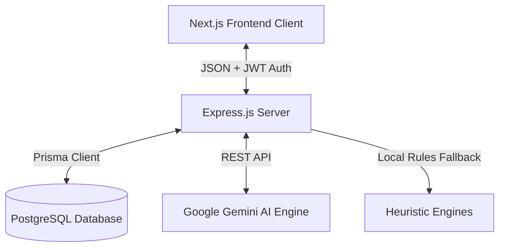
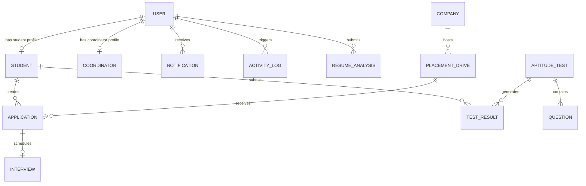

# 🚀 PlaceTrack AI

PlaceTrack AI is a full-stack, enterprise-grade Placement Management and Student Readiness platform custom-tailored for engineering college placement workflows (styled around KK Wagh-style configurations). It enables students, coordinators, and administrators to seamlessly manage placement drives, review student eligibility, analyze resumes, practice interviews using generative AI, take mock tests, and view comprehensive placement dashboards and analytics.

---

## 🏗️ Architecture Overview

The project is structured as a monorepo containing two main packages:
- **`frontend/`**: Next.js 15 app router using React 19, Vanilla CSS, Recharts for data visualizations, Framer Motion for responsive fluid transitions, and Lucide React icons.
- **`backend/`**: Express v5 service built with TypeScript, Prisma ORM, and PostgreSQL. It contains the business rules engine, AI integration wrappers, and secure JWT-based role authorization middleware.

### System Diagram



---

## 📂 Project Structure

```text
├── backend/                  # Express REST API & Database logic
│   ├── prisma/
│   │   ├── schema.prisma     # Prisma Database Schema definitions
│   │   └── seed.ts           # 500+ student KK Wagh placement seed script
│   ├── src/
│   │   ├── lib/              # Prisma client & Audit logger instance
│   │   ├── middleware/       # JWT Auth & Role-based Authorization guards
│   │   ├── routes/           # REST endpoints grouped by resource
│   │   ├── services/         # Eligibility, Readiness, & Gemini AI integrations
│   │   ├── types/            # TypeScript type annotations
│   │   └── server.ts         # Main server entrypoint with auto-seeding
│   ├── tests/                # Vitest backend unit test suite
│   ├── package.json
│   └── tsconfig.json
│
├── frontend/                 # Next.js SPA Client application
│   ├── src/
│   │   ├── app/              # Next.js App Router (Layout & main Dashboard page)
│   │   ├── components/       # Dashboard components, Resume AI and interactive UI components
│   │   └── lib/              # Fetch API wrappers, types, and client credentials
│   ├── package.json
│   └── tsconfig.json
│
├── docker-compose.yml        # PostgreSQL container setup
├── package.json              # Monorepo workspaces config
└── README.md                 # Project documentation
```

---

## 📊 Database Schema & Relations

The PostgreSQL database contains the following relational model schema managed by Prisma:



### Main Entities

*   **`User`**: System-wide authentication profiles. Stores credentials and maps to a specific `UserRole` (`STUDENT`, `COORDINATOR`, `ADMIN`).
*   **`Student`**: Academic profiles including Branch, CGPA, graduation year, active backlogs, skills list, and aggregated placement readiness scores.
*   **`Coordinator`**: Staff profiles containing department and contact information.
*   **`Company`**: Recruiters (e.g., NVIDIA, TCS, Persistent Systems, Crompton Greaves) hosting jobs.
*   **`PlacementDrive`**: Specific job openings hosted by companies detailing constraints (minimum CGPA, max backlogs, allowed branches, graduation year, package, location).
*   **`Application`**: Relates a Student to a PlacementDrive. Holds status tracking pipelines (`APPLIED`, `SHORTLISTED`, `APTITUDE_CLEARED`, `TECHNICAL_ROUND`, `HR_ROUND`, `SELECTED`, `REJECTED`) and history.
*   **`Interview`**: Contains information about scheduled candidate reviews (dateTime, mode, location link, feedback).
*   **`AptitudeTest` & `Question`**: Implements mock assessments and testing engine.
*   **`TestResult`**: Scores and performance metrics parsed per assessment section.

---

## ⚙️ Algorithms & Subsystems

### 1. Placement Eligibility Engine

Before a student can apply for a Placement Drive, a pre-screening algorithm validates the criteria. If eligible, it calculates a suitability score:

*   **Hard Constraints Checked**:
    *   `student.cgpa >= drive.minCgpa`
    *   `drive.allowedBranches.includes(student.branch)`
    *   `student.backlogs <= drive.maxBacklogs`
    *   `student.graduationYear === drive.graduationYear`
*   **Suitability Score Calculation (Scale: 50–100)**:
    *   **Base Score**: 50 points if all hard constraints are met.
    *   **CGPA Performance Bonus**: Up to 15 points based on margin above threshold (`Math.round((student.cgpa - drive.minCgpa) * 10)`).
    *   **Skill Match Bonus**: Up to 30 points (10 points per matching skill listed in the job description or role string).
    *   **Branch Focus Bonus**: Up to 15 points if the drive targets a specialized small branch list (<= 2 branches) or matches key AI/Data Science keywords.

### 2. Student Readiness Predictor

Computes a readiness level mapping student metrics to placement probability:

$$\text{Readiness Score} = \text{clamp}\left( \left(\frac{\text{CGPA}}{10} \times 22\right) + (\text{Aptitude} \times 0.18) + (\text{Coding} \times 0.22) + (\text{Comm} \times 0.15) + (\text{Proj} \times 4) + (\text{Intern} \times 5) + (\text{Mocks} \times 1.2) - (\text{Backlogs} \times 7) \right)$$

*   **Category Ranges**:
    *   `>= 80`: **Placement ready** 🟢
    *   `65 - 79`: **Nearly ready** 🟡
    *   `< 65`: **Needs focused preparation** 🔴
*   **Strengths & Weaknesses**: Auto-labels metrics falling under 65% as target growth areas and generates a personalized preparation plan.

### 3. AI Services & Fallbacks

*   **Resume Analytics**: Analyzes resume content (raw text or PDF text extracted via `pdf-parse`) using **Google Gemini** integration. If the Gemini API key is missing or calls fail, a regex-based heuristic fallback triggers to parse sections, quantify metrics, and evaluate common keywords.
*   **AI Mock Interviewer**: Generates custom interview questions based on the candidate's target track (frontend, backend, hardware, system, or custom prompt parameters) with inline feedback advice.

---

## 🔑 User Roles & Demo Accounts

The platform uses JWT authorization with role-based dashboard states. For local development and testing, demo accounts (Student, Coordinator, and Admin) are pre-seeded in the database.

> [!NOTE]
> Refer to the database seeding script at [seed.ts](file:///c:/Users/Asus/Documents/Codex/2026-06-23/pdf-plugin-pdf-openai-primary-runtime-2/backend/prisma/seed.ts) to view the configured test accounts and credentials for local development. Never expose or commit production credentials or real user passwords to the repository.

---

## 🔌 API Documentation

| Method | Endpoint | Authorization | Description |
| :--- | :--- | :--- | :--- |
| **GET** | `/health` | Public | API and Database connectivity health-check |
| **POST** | `/api/auth/login` | Public | Logs user in, returns signed JWT and safe user object |
| **POST** | `/api/auth/signup` | Public | Registers a new Student/Coordinator account |
| **GET** | `/api/auth/me` | User | Fetch profile metadata and unread notifications |
| **PATCH**| `/api/auth/me/student`| Student | Update personal profile parameters (re-calculates readiness) |
| **GET** | `/api/auth/users` | Admin | Get list of all registered accounts |
| **DELETE**| `/api/auth/users/:id` | Admin | Delete a user profile and clean up dependencies |
| **GET** | `/api/dashboard` | User | Aggregates role-specific dashboards analytics |
| **GET** | `/api/drives` | User | Retrieve list of placement drives with eligibility state |
| **POST** | `/api/drives` | Coordinator, Admin | Post a new placement drive |
| **GET** | `/api/applications` | User | Query applications (restricted to owner if Student) |
| **POST** | `/api/applications` | Student | Submit eligibility-filtered application |
| **PATCH**| `/api/applications/:id/status`| Coordinator, Admin | Progress application state and push notification |
| **POST** | `/api/applications/:id/interview`| Coordinator, Admin| Schedule a student interview stage |
| **GET** | `/api/tests` | User | Retrieve all mock aptitude tests |
| **GET** | `/api/tests/:id` | User | Retrieve individual test details and questions |
| **POST** | `/api/tests/:id/submit`| Student | Submit answers, score assessment, track metrics |
| **POST** | `/api/ai/resume/text`| Student | Review raw text resume suggestions |
| **POST** | `/api/ai/resume/upload`| Student | Extract text from PDF, analyze metrics and skills |
| **POST** | `/api/ai/interview` | User | Prompt Gemini to generate target role questions |
| **GET** | `/api/reports/applications.csv`| Coordinator, Admin| Download CSV export of all drive applications |
| **GET** | `/api/reports/students.csv`| Coordinator, Admin| Download CSV export of student performance registry |

---

## 🛠️ Installation & Setup

### Prerequisites
*   [Node.js](https://nodejs.org/) v20+
*   [Docker Desktop](https://www.docker.com/products/docker-desktop/) (for local PostgreSQL database)

### Step 1: Environment Variables Setup
Configure the environment variables. You can copy the template:
```bash
cp .env.example .env
```
Ensure the configurations in `.env` match your local deployment requirements:
*   `DATABASE_URL`: Connection string pointing to PostgreSQL.
*   `JWT_SECRET`: Unique secure string for signing authentication tokens.
*   `GEMINI_API_KEY`: *(Optional)* Your Google AI Gemini developer key. If left blank, heuristic fallbacks will perform parsing operations.

### Step 2: Spin Up Database
Use docker-compose to launch a PostgreSQL instance:
```bash
docker compose up -d
```

### Step 3: Run Database Migrations & Seeding
Install monorepo dependencies, push the schema to the database, and execute the seed script:
```bash
# Install root, backend, and frontend packages
npm install

# Sync DB schema with Prisma Models
npm run prisma:push -w backend

# Seed the database with KK Wagh demo profiles
npm run prisma:seed -w backend
```

### Step 4: Launch Development Servers
Launch both the frontend client (Next.js) and the backend API (Express) concurrently:
```bash
npm run dev
```

*   **Frontend Client**: `http://localhost:3000`
*   **Backend Server**: `http://localhost:4000`
*   **API Health**: `http://localhost:4000/health`

---

## 🧪 Testing & Validation

Backend controllers, calculators, and engines are validated via Vitest. To run the automated unit testing suites:

```bash
npm test
```

To typecheck the entire typescript codebase across both packages:
```bash
npm run typecheck
```

---

## 💡 Notes & Troubleshooting

*   **Prisma DLL Locks**: If `prisma generate` fails on Windows due to file locks on the query engine, stop active dev processes and run the build command manually (`npm run build -w backend`).
*   **Postgres Version**: The `docker-compose.yml` uses `postgres:13.0` for local system efficiency. If you require features from newer PostgreSQL releases, edit the tag in the configuration file before launching the containers.
