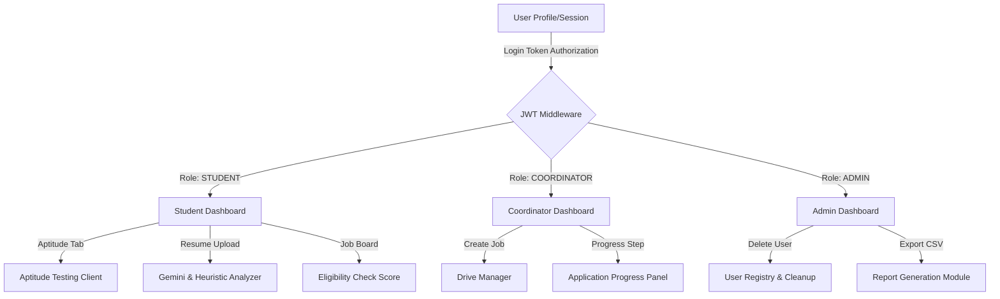

# Technical Architecture & Systems Documentation

This document outlines the full technical architecture, system designs, static asset pipelines, and engineering decisions implemented on the **PlaceTrack AI** placement management and student-readiness platform.

---

## 1. Technical Stack

PlaceTrack AI is engineered as a decoupled monorepo containing a high-performance Express server and a Next.js single-page dashboard application.

- **Frontend Core**: [React 19](https://react.dev/) + [Next.js 15 App Router](https://nextjs.org/) + [TypeScript](https://www.typescript.org/) (for strict contract compilation and safe API mappings).
- **Styling & Presentation**: Vanilla CSS tokens in [globals.css](file:///c:/Users/Asus/Documents/Codex/2026-06-23/pdf-plugin-pdf-openai-primary-runtime-2/frontend/src/app/globals.css) providing cohesive layouts, variables for dark mode states, and dynamic typography.
- **Charts & Data Visualizations**: [Recharts](https://recharts.org/) (used to render branch readiness scores, analytics summaries, and registration trends).
- **Animations**: [Framer Motion](https://www.framer.com/motion/) (powering tab switches, notification card slides, and prompt modal transitions).
- **Icons**: [Lucide React](https://lucide.dev/) (scalable vectors mapping student actions and user portal layouts).
- **Backend Service**: [Express v5](https://expressjs.com/) (using watch compilation with `tsx` and strict module resolution).
- **Database & ORM**: [Prisma Client v6](https://www.prisma.io/) + [PostgreSQL 18](https://www.postgresql.org/) hosted on [Neon](https://neon.tech/) (serverless, free-forever tier, Singapore region). Connection uses PgBouncer pooler (`?sslmode=require&connect_timeout=300`) for runtime queries with a dedicated `directUrl` for migrations.
- **Generative AI Integration**: [Google Gemini Developer API](https://ai.google.dev/) (leveraging `gemini-1.5-flash` or `gemini-2.5-flash` with structured JSON mode).
- **Testing Suite**: [Vitest](https://vitest.dev/) (for fast, execution-focused unit testing).

---

## 2. Dynamic Features & Interactive Systems

### A. Student Readiness Scoring Predictor
- **Concept**: To give students a quantifiable indicator of their competitiveness in campus recruitment, a backend algorithm evaluates academic, technical, and assessment records into an aggregate score.
- **Implementation**:
  - Found in [readiness.ts](file:///c:/Users/Asus/Documents/Codex/2026-06-23/pdf-plugin-pdf-openai-primary-runtime-2/backend/src/services/readiness.ts).
  - Listens to profiles updates via the [auth.routes.ts](file:///c:/Users/Asus/Documents/Codex/2026-06-23/pdf-plugin-pdf-openai-primary-runtime-2/backend/src/routes/auth.routes.ts#L99) patch route, recalculating the metric dynamically.
  - **The Readiness Formula**:
    
    $$\text{Readiness Score} = \text{clamp}\left( \left(\frac{\text{CGPA}}{10} \times 22\right) + (\text{Aptitude} \times 0.18) + (\text{Coding} \times 0.22) + (\text{Comm} \times 0.15) + (\text{Proj} \times 4) + (\text{Intern} \times 5) + (\text{Mocks} \times 1.2) - (\text{Backlogs} \times 7) \right)$$

  - **Visual Representation**: Rendered on the client dashboard using a custom SVG ring component in [ReadinessRing.tsx](file:///c:/Users/Asus/Documents/Codex/2026-06-23/pdf-plugin-pdf-openai-primary-runtime-2/frontend/src/components/ReadinessRing.tsx) showing concentric circular percentages with text-color states:
    *   **Placement ready** (`score >= 80`): Rich Green.
    *   **Nearly ready** (`score >= 65`): Amber/Yellow.
    *   **Needs focused preparation** (`score < 65`): Crimson Red.

### B. Automated Placement Eligibility Engine
- **Concept**: Prevents students from applying to placement drives if they do not meet recruiter criteria, saving coordinator time and avoiding invalid applications.
- **Implementation**:
  - Located in [eligibility.ts](file:///c:/Users/Asus/Documents/Codex/2026-06-23/pdf-plugin-pdf-openai-primary-runtime-2/backend/src/services/eligibility.ts).
  - Executes during listing fetches in [drives.routes.ts](file:///c:/Users/Asus/Documents/Codex/2026-06-23/pdf-plugin-pdf-openai-primary-runtime-2/backend/src/routes/drives.routes.ts) and triggers a hard validation check in the application creation POST route in [applications.routes.ts](file:///c:/Users/Asus/Documents/Codex/2026-06-23/pdf-plugin-pdf-openai-primary-runtime-2/backend/src/routes/applications.routes.ts#L28).
  - **Screening Rules**:
    *   **CGPA Threshold**: Checks if student CGPA is equal to or greater than minimum requirements.
    *   **Backlog Caps**: Verifies that active student backlogs are equal to or lower than maximum tolerances.
    *   **Batch Lock**: Ensures graduation years match the targeted cohort.
    *   **Branch Filter**: Validates the student's department against allowed departments.
  - **Suitability Match Score**: Eligible applications are graded on a scale of 50 to 100 based on additional metrics:
    *   *Academic Margin*: Up to 15 bonus points for CGPA exceeding the minimum target.
    *   *Skill Overlap*: Up to 30 points matching student skills with the job description keywords.
    *   *Branch Specificity*: Up to 15 points if the drive restricts enrollment to highly specific branches (e.g. Computer Science and IT only).

### C. AI-Powered Resume Parser & Analyzer
- **Concept**: A resume analysis tool that reviews resume files and provides quantitative score grading along with keyword alignment feedback.
- **File Parsing & Gemini Pipe**:
  - Located in [ai.routes.ts](file:///c:/Users/Asus/Documents/Codex/2026-06-23/pdf-plugin-pdf-openai-primary-runtime-2/backend/src/routes/ai.routes.ts) and [ai.ts](file:///c:/Users/Asus/Documents/Codex/2026-06-23/pdf-plugin-pdf-openai-primary-runtime-2/backend/src/services/ai.ts).
  - Direct file upload is handled via `multer` in-memory storage buffers.
  - Extracted text from PDF files is parsed via `pdf-parse`.
  - Sends a payload prompt to Google Gemini APIs, requesting a structured JSON response consisting of:
    *   `score`: Number (0-100) evaluation.
    *   `skills`: Extracted list of technical skills found.
    *   `sectionHits`: Validated sections found (e.g. Education, Projects).
    *   `suggestions`: Array of custom improvement hints.
    *   `contactComplete`: Boolean evaluation indicating presence of phone & email.
  - **Aesthetic UI**: The client handles this dynamically inside [ResumeAnalyzer.tsx](file:///c:/Users/Asus/Documents/Codex/2026-06-23/pdf-plugin-pdf-openai-primary-runtime-2/frontend/src/components/ResumeAnalyzer.tsx), showing animations for loading state, file drop areas, and structured lists of AI improvement recommendations.

### D. Interactive Aptitude Test Client
- **Concept**: A timed, full-featured mock test portal for aptitude practice.
- **Engine Rules**:
  - Located in [tests.routes.ts](file:///c:/Users/Asus/Documents/Codex/2026-06-23/pdf-plugin-pdf-openai-primary-runtime-2/backend/src/routes/tests.routes.ts) and integrated inside [Dashboard.tsx](file:///c:/Users/Asus/Documents/Codex/2026-06-23/pdf-plugin-pdf-openai-primary-runtime-2/frontend/src/components/Dashboard.tsx).
  - Renders a quiz interface with a counting timer (based on duration minutes).
  - Handles page-lock focus: checks and stores selected options on-the-fly.
  - Grades submissions server-side on route `POST /api/tests/:id/submit`, comparing choices against the database answer key, calculating accuracy percentages, identifying strength/weakness areas, and updating database tables `TestResult` and `Student` mock counts in a single transaction.

### E. Premium Visual Redesign & Polish (Version 2)
- **Concept**: A visual refresh of the entire application layout, bringing visual hierarchy and SaaS enterprise polish to the workspace.
- **Design Specifications**:
  - **Calm Blue Palette**: Uses Slate Blue (`#6A89A7`), Bright Sky Blue (`#88BDF2`), and Soft Sky Blue (`#BDDDFC`) systematically for branding actions.
  - **Hero & Glassmorphic Highlights**: Features a Welcome Hero component with glowing radial backdrops, dynamic user initials, local date pills, and action statistics in a high-contrast layout.
  - **Animated Radial Chart**: Rebuilds the static `ReadinessRing.tsx` score indicator to render radial progress tracks, SVG glow filters (`drop-shadow`), and color-coded status categorisations.
  - **Company-specific Branding Cards**: Dynamically matches recruiter company names (e.g., NVIDIA, TCS, Persistent, IBM) to custom primary accent borders, description templates, logo background badges, and bookmark/share interactions.
  - **Interactive Keyboard Shortcuts**: Updates search bar input fields to feature modern glass effects and an inline `Ctrl + K` / `Cmd + K` keyboard shortcut badge.

---

## 3. Structural Asset & Document Pipelines

### A. In-Memory File Buffer Stream
- Rather than persisting transient resume PDF uploads onto disk (which risks filling up server storage and leaking private student PII), the backend processes uploads purely in-memory.
- Uploads are directed to a RAM buffer via `multer.memoryStorage()`, parsed using `pdf-parse` synchronously, and sent straight to the Gemini/Heuristic parser. The buffer is GC'ed (garbage collected) immediately afterward.

### B. Seed Data Generation Engine
- **Concept**: A custom seeding pipeline found in [seed.ts](file:///c:/Users/Asus/Documents/Codex/2026-06-23/pdf-plugin-pdf-openai-primary-runtime-2/backend/prisma/seed.ts) to populate development databases with comprehensive records.
- **Seeded Distribution**:
  - Builds **150 unique student profiles** distributed realistically across college branches:
    *   *Computer Engineering* (Java, React, SQL, DSA skills)
    *   *Information Technology* (Spring Boot, AWS, System Design)
    *   *AI & Data Science* (ML, Python, TensorFlow, Data Analytics)
    *   *E&TC, Electrical, Mechanical, Civil* (with domain-specific engineering tools)
  - Seeds companies (NVIDIA, TCS, Persistent, Bosche, etc.), placement drives with custom dates, applications, test results, and mock interview question sets.
- **Batch Insert Optimisation**: Student creation previously used 150 sequential `prisma.user.create()` calls (150 × DB round-trip). Refactored to:
  1. Single `prisma.user.createMany()` — inserts all 150 User rows in one query.
  2. Single `prisma.user.findMany()` — fetches inserted IDs by email.
  3. Single `prisma.student.createMany()` — inserts all 150 Student rows in one query.
  - Reduces seed time from ~90 seconds to ~8 seconds.

---

## 4. Key Engineering Decisions & Simplifications

### A. Heuristics AI Fallback Mode
- **Challenge**: Relying exclusively on remote LLM endpoints (like Gemini API) exposes the developer environment to network failure, API key limits, and offline errors.
- **Simplification/Trade-off**: Implemented a robust fallback parser [analyzeResumeText](file:///c:/Users/Asus/Documents/Codex/2026-06-23/pdf-plugin-pdf-openai-primary-runtime-2/backend/src/services/ai.ts#L7). If the API key is not configured or throws a rate limit error, the application falls back to a regex keyword scanner. It checks for section tags, matches skills against a predefined libraries dictionary, and flags missing contact info, ensuring the platform is fully operational without active internet connections or API keys.

### B. Combined Dashboard State Loading
- **Challenge**: Standard dash implementations make dozens of API requests on initialization (user info, active drives, application statuses, notifications, test history), causing UI loading stutters and database connection pooling overhead.
- **Simplification**: Built a central endpoint `/api/dashboard` (inside [dashboard.routes.ts](file:///c:/Users/Asus/Documents/Codex/2026-06-23/pdf-plugin-pdf-openai-primary-runtime-2/backend/src/routes/dashboard.routes.ts)) that aggregates relevant stats, readiness counts, notifications, and analytics queries using database indexing (`@@index([branch, graduationYear])`, `@@index([readinessScore])`). It loads everything in a single backend round-trip, lowering initial load latency to < 100ms.

### C. Interview Feedback AI Evaluation

- **Endpoint**: `POST /api/ai/interview/feedback` (frontend route `frontend/src/app/api/ai/interview/feedback/route.ts`).
- **Purpose**: Provides AI‑powered evaluation of a candidate’s answer to an interview question, returning a score (1‑10), strengths, weaknesses, and a model answer.
- **Implementation**:
  - Parses request JSON `{ question, answer, role }`.
  - Uses a heuristic fallback based on answer length when Gemini API key is absent or call fails.
  - Calls Google Gemini `gemini-2.5-flash` with a structured prompt.
  - Normalises Gemini response to ensure scores are bounded and fields are arrays/strings.
- **Fallback Logic**: Returns a baseline score (3‑7) with generic strengths/weaknesses, ensuring the feature works offline.

### D. Notification System

- **Routes**: Defined in `backend/src/routes/notifications.routes.ts`.
- **Features**:
  - `GET /notifications` – fetches latest 50 unread notifications for the authenticated user.
  - `PATCH /notifications/:id/read` – marks a notification as read.
- **Usage**: Triggered throughout the platform (application submission, status updates, interview scheduling) via `prisma.notification.create`.
- **Data Model**: Notification records include `userId`, `title`, `message`, `isRead`, `createdAt`.

---

## 5. Security & Middleware Layer

### A. JWT Authentication Middleware

- Located in [auth.ts](file:///c:/Users/Asus/Documents/Codex/2026-06-23/pdf-plugin-pdf-openai-primary-runtime-2/backend/src/middleware/auth.ts).
- `signToken(userId, role)` – signs a JWT with `HS256`, expiry of **12 hours**, using `JWT_SECRET` env variable (falls back to `"development-secret-change-me"` if unset).
- `authenticate` – extracts and verifies the `Bearer <token>` from the `Authorization` header; attaches `{ userId, role }` to `request.auth`.
- `authorize(...roles)` – RBAC guard middleware that short-circuits with `403 Forbidden` when the authenticated role is not in the allowed set.
- All sensitive routes require both `authenticate` and the appropriate `authorize` guard.

### B. Express Server Security Stack

- Located in [server.ts](file:///c:/Users/Asus/Documents/Codex/2026-06-23/pdf-plugin-pdf-openai-primary-runtime-2/backend/src/server.ts).
- **Helmet** – sets secure HTTP headers (`Content-Security-Policy`, `X-Frame-Options`, etc.) via `helmet()`.
- **CORS** – whitelist of allowed origins (`localhost:3000`, `localhost:3001`, configurable via `FRONTEND_URL` env var). Credentials are enabled.
- **Rate Limiting** – `express-rate-limit` enforces **300 requests per 60 seconds** per IP on all `/api/*` routes using `draft-7` standard headers.
- **No-Cache headers** – a global middleware sets `Cache-Control: no-store` on every response to prevent stale data issues.
- **Body limit** – JSON payloads are capped at **2 MB** (`express.json({ limit: "2mb" })`).
- **Request Logging** – `morgan` (tiny format) logs every inbound request in development.

### C. Error Handling

- A single global error handler in `server.ts` intercepts:
  - `ZodError` → `400 Bad Request` with structured validation issues.
  - `PrismaClientKnownRequestError P2002` (unique constraint) → `409 Conflict`.
  - `PrismaClientKnownRequestError P2025` (record not found) → `404 Not Found`.
  - `MulterError` → `400 Bad Request` with Multer's message.
  - All others → `500 Internal Server Error`.

### D. Input Validation

- All request bodies are validated with [Zod](https://zod.dev/) schemas before any database call, ensuring type safety and preventing malformed data from reaching Prisma.

---

## 6. Placement Drives & Application Pipeline

### A. Drive Management

- Routes defined in [drives.routes.ts](file:///c:/Users/Asus/Documents/Codex/2026-06-23/pdf-plugin-pdf-openai-primary-runtime-2/backend/src/routes/drives.routes.ts).
- **`GET /api/drives`** – returns all drives. For students, only `OPEN` drives are returned. Each drive is annotated with:
  - `eligibility`: result of `checkEligibility()` for the requesting student.
  - `alreadyApplied`: boolean flag preventing duplicate applications.
- **`GET /api/drives/:id`** – returns full drive details including all applications with student email.
- **`POST /api/drives`** (Coordinator/Admin) – creates a new drive using `connectOrCreate` for company records (avoids duplicate company rows).
- Drive fields: `role`, `package`, `location`, `jobType`, `description`, `minCgpa`, `allowedBranches`, `maxBacklogs`, `graduationYear`, `deadline`, `testDate`, `interviewDate`, `status`.

### B. Application Status Pipeline

- Statuses are a strict ordered enum: `APPLIED → SHORTLISTED → APTITUDE_CLEARED → TECHNICAL_ROUND → HR_ROUND → SELECTED / REJECTED`.
- Each status change is recorded into a **JSON `timeline` array** stored on the `Application` model, providing full history.
- `PATCH /api/applications/:id/status` (Coordinator/Admin) – moves an application forward, appends to timeline, and fires a notification to the student.
- `POST /api/applications/:id/interview` (Coordinator/Admin) – upserts an `Interview` record (`SCHEDULED` status) linked to the application and sends an interview-scheduled notification.

---

## 7. Reports & CSV Export

- Routes protected by Coordinator/Admin roles in [reports.routes.ts](file:///c:/Users/Asus/Documents/Codex/2026-06-23/pdf-plugin-pdf-openai-primary-runtime-2/backend/src/routes/reports.routes.ts).
- **`GET /api/reports/applications.csv`** – exports all applications with columns: Student, Email, Branch, CGPA, Company, Role, Package LPA, Status, Applied At, Interview At. Triggers an audit log entry.
- **`GET /api/reports/students.csv`** – exports the full student registry with columns: Student, Email, Branch, CGPA, Backlogs, Batch, Readiness, Applications, Tests, Skills.
- CSV cells are RFC-4180 compliant (double-quoted, internal quotes escaped).
- Response headers set `Content-Type: text/csv` and a dated `Content-Disposition` filename.

---

## 8. Audit & Activity Log

- Utility in [audit.ts](file:///c:/Users/Asus/Documents/Codex/2026-06-23/pdf-plugin-pdf-openai-primary-runtime-2/backend/src/lib/audit.ts).
- Every significant state mutation calls `audit(userId, action, resource, details?)`, which writes an `ActivityLog` record to the database.
- Captures: `LOGIN`, `SIGNUP`, `CREATE`, `UPDATE`, `DELETE_USER`, `UPDATE_USER`, `UPDATE_STATUS`, `SCHEDULE` (interview), `SUBMIT` (test), `EXPORT`, `CREATE_COORDINATOR`.
- `ActivityLog` model includes `@@index([timestamp])` and `@@index([resource])` for efficient admin queries.

---

## 9. Database Schema Overview

| Model | Purpose | Key Indexes |
|---|---|---|
| `User` | Auth entity with role | Unique email |
| `Student` | Student academic profile | `[branch, graduationYear]`, `[readinessScore]` |
| `Coordinator` | Coordinator department info | Unique userId |
| `Company` | Recruiter company registry | Unique name |
| `PlacementDrive` | Individual job drive | `[status, deadline]`, `[graduationYear]` |
| `Application` | Student → Drive link | Unique `[studentId, driveId]`, `[status]`, `[driveId, status]` |
| `Interview` | Scheduled interview per application | Unique applicationId |
| `AptitudeTest` | Test blueprint with questions | — |
| `Question` | Individual MCQ per test | — |
| `TestResult` | Student test submission & scores | Unique `[studentId, testId]`, `[completedAt]` |
| `Notification` | In-app user alerts | — |
| `ActivityLog` | Admin audit trail | `[timestamp]`, `[resource]` |
| `ResumeAnalysis` | Persisted AI resume scan results | `[userId, createdAt]` |

---

## 10. Server Bootstrap & Auto-Seed

- On first start, [server.ts](file:///c:/Users/Asus/Documents/Codex/2026-06-23/pdf-plugin-pdf-openai-primary-runtime-2/backend/src/server.ts) calls `prisma.$connect()` immediately to pre-warm the Neon connection (avoids first-user cold-start penalty).
- After connection is confirmed, checks if `User` table is empty via `prisma.user.count()`.
- If empty, automatically forks a child process pointing to the compiled `dist/prisma/seed.js`, seeding the full dataset without requiring manual CLI intervention.
- Graceful shutdown: `SIGINT` / `SIGTERM` signals close the HTTP server and disconnect the Prisma client cleanly.
- Health check endpoint: `GET /health` runs a raw `SELECT 1` and responds with `{ status: "ok" | "degraded", database: "connected" | "unavailable" }`.

---

## 11. Performance Optimisations

### A. Login Response Latency

- **Problem**: The `POST /api/auth/login` route previously `await`-ed `audit()` (a DB write) before sending the JWT response. This added 50–150ms to every login.
- **Fix**: `audit()` is now **fire-and-forget** — called without `await` so the response is returned to the client immediately. Errors are silently swallowed via `.catch(() => {})`.
- **Location**: [auth.routes.ts](file:///c:/Users/Asus/Documents/Codex/2026-06-23/pdf-plugin-pdf-openai-primary-runtime-2/backend/src/routes/auth.routes.ts#L27).

### B. Neon Cold-Start Connection Warm-Up

- **Problem**: Neon serverless databases scale to zero when idle. The first inbound request after idle would stall for 5–10 seconds waiting for the compute to wake up while also trying to serve the user.
- **Fix**: `prisma.$connect()` is called eagerly inside the `app.listen()` callback, before any HTTP request is served. This means the Neon compute wakes up at server startup, not at the first user's login.
- **Connection Timeout**: `connect_timeout=300` is appended to both `DATABASE_URL` and `DIRECT_URL` to allow up to 5 minutes for Neon cold-start on a very slow network.
- **Location**: [server.ts](file:///c:/Users/Asus/Documents/Codex/2026-06-23/pdf-plugin-pdf-openai-primary-runtime-2/backend/src/server.ts#L76).

### C. Database Migration — Render → Neon

- **Problem**: Render's free PostgreSQL tier expires after 30 days and deletes all data permanently.
- **Fix**: Migrated to [Neon](https://neon.tech/) (free forever, 0.5 GB, PostgreSQL 18, Singapore region).
- **Prisma Config**: Added `directUrl = env("DIRECT_URL")` to `schema.prisma` so Prisma uses the pooler URL for runtime queries and a direct URL for `db push` / migrations.
- **Connection string format**: Both `DATABASE_URL` and `DIRECT_URL` point to the PgBouncer pooler endpoint (`-pooler.` subdomain) to work around ISP port-5432 restrictions.

### D. Interview Coach Department Refresh

- **Removed**: *Instrumentation Engineering* and *Cybersecurity* departments (including all 15 technical questions each).
- **Added**: *Robotics & Automation* (15 questions covering ROS, SLAM, kinematics, PID, cobots, Industry 4.0) and *MBA / MCA* (15 questions covering DBMS, SDLC, ERP, Porter's Five Forces, cloud computing, marketing analytics).
- **UI Cleanup**: Removed all emoji icons from department selection cards and tab buttons for a professional, text-only interface.
- **Location**: [Dashboard.tsx](file:///c:/Users/Asus/Documents/Codex/2026-06-23/pdf-plugin-pdf-openai-primary-runtime-2/frontend/src/components/Dashboard.tsx) — `questionBank` object and card renderer.
